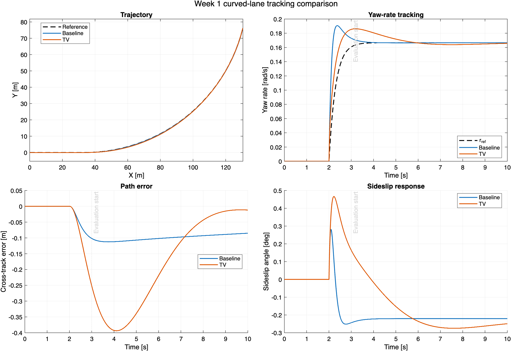
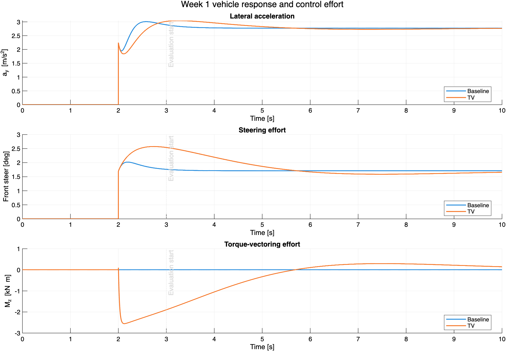

# Week 1 curved-lane validation

This directory contains the reproducible bicycle-model comparison generated
by `runCurvedLaneComparison` on 2026-07-21.

## Test definition

- Controllers: Baseline and torque vectoring (TV)
- Plant: linear E-Class bicycle model
- Speed: 60 km/h (16.667 m/s)
- Road friction coefficient: 0.9
- Curve radius: 100 m
- Curve entry: 2 s
- Simulation stop time: 10 s
- Metric interval: 3 s through 10 s

The full turn-entry transient remains visible in the figures. The one-second
delay before metric evaluation prevents the curvature step itself from
dominating every RMS value.

## Results

| Metric | Baseline | TV |
| --- | ---: | ---: |
| Final yaw rate [rad/s] | 0.16652 | 0.16582 |
| Yaw-rate RMSE [rad/s] | 0.001882 | 0.008485 |
| Cross-track RMSE [m] | 0.09993 | 0.23158 |
| Peak heading error [deg] | 0.2097 | 1.1208 |
| Peak sideslip magnitude [deg] | 0.2436 | 0.2749 |
| Peak lateral acceleration [m/s^2] | 2.8914 | 3.0432 |
| Steering RMS [deg] | 1.7136 | 1.8238 |
| Yaw-moment RMS [N m] | 0 | 652.89 |
| Peak yaw moment [N m] | 0 | 1897.04 |
| Yaw-moment saturation fraction | 0 | 0 |

The exact machine-readable values are in [`metrics.csv`](metrics.csv).

## Interpretation and limitations

Both variants are finite, respect the common controller interface, complete
the same scenario, and converge close to the 0.1667 rad/s steady path yaw
rate. The TV controller commands no additional steering and remains below
its 5000 N m yaw-moment limit.

For this initial literature-faithful configuration, TV does **not** improve
the 60-km/h comparison metrics: it produces a slower yaw transient and more
cross-track error than the baseline steering controller. This is a useful
Week 1 result rather than a reason to hide or retune the data. The published
PID gains were designed around 90 km/h, and the source explicitly calls for
speed scheduling outside that narrow operating region. No such schedule is
published, so silently retuning the gains would no longer be the same
literature baseline.

The implementation also adapts the paper to the available project model:

- path curvature replaces the paper's driver-steering yaw-reference map;
- an analytical E-Class bicycle equilibrium replaces unavailable
  quasi-static feedforward lookup tables;
- a fixed 5000 N m authority replaces a wheel-level feasible-moment
  allocator; and
- back-calculation anti-windup is used because the paper does not publish
  its anti-windup realization.

The next controlled experiment should preserve this result as the
"published-gain" case and add a separately named 60-km/h E-Class tuning or
speed schedule. Week 2 then adds AFS, the double-lane-change maneuver, and
the higher-fidelity plant adapters.
